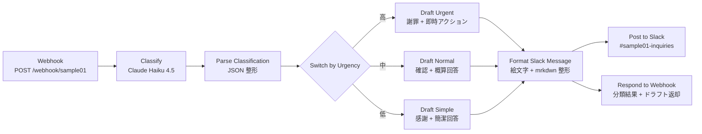

# Sample01 ワークフロー全体図

問い合わせメール受信 → Claude による自動分類 → 緊急度別の返信ドラフト生成 → Slack 通知。

## 設計上のポイント

- **分類モデル**: `claude-haiku-4-5-20251001`(コスト約 0.5 円/件、日本語問い合わせを 4 軸で分類)
- **4 軸分類**: category(質問/苦情/見積もり依頼/予約・問い合わせ/その他)/ urgency(高/中/低)/ sentiment(ポジ/ニュ/ネガ)/ recommended_response_deadline(2h/24h/3営業日)
- **3 分岐ドラフト**: urgency(高/中/低)で異なる返信トーンと構成。プロンプトを切り分けることで、緊急トラブルへの謝罪先行と、感謝ベース問い合わせへの簡潔返信を両立
- **Slack 整形**: urgency に応じた絵文字(:red_circle: / :large_yellow_circle: / :large_green_circle:)を冒頭に付与、元メッセージと生成ドラフトを mrkdwn で並列表示
- **Webhook 同期返却**: Slack 投稿と並行して、呼び出し元に分類結果 + ドラフトを返すので、別システムからの組み込みも容易

## 計測値(Step 5、2026-05-08 実測)

- 分類精度: 10/10(全フィールド一致)
- 1 件あたりコスト: 約 0.5 円(分類 + ドラフト生成込み)
- レイテンシ: 数秒(API 呼び出し 2 回 = 分類 + ドラフト生成)
