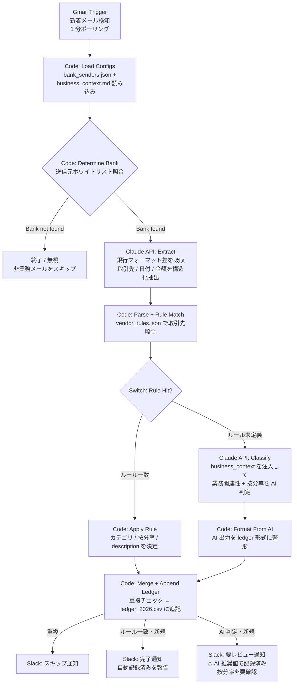

# Sample02 ワークフロー図と設計ポイント

## フロー図

## ノード構成

| # | ノード名 | 種別 | 役割 |
|---|---|---|---|
| 1 | Gmail Trigger | Gmail Trigger | 1 分ポーリングで新着メール検知 |
| 2 | Load Configs | Code | bank_senders.json + business_context.md を読み込み |
| 3 | Determine Bank | Code | 送信元ホワイトリスト照合 |
| 4 | Bank Found? | Switch | bank_found フラグで分岐 |
| 5 | Extract | HTTP Request | Claude API で取引情報抽出(Tool Use) |
| 6 | Parse + Rule Match | Code | 抽出結果パース + vendor_rules 照合 |
| 7 | Rule Hit? | Switch | rule_matched フラグで分岐 |
| 8 | Apply Rule | Code | ルールからカテゴリ/按分率決定 |
| 9 | Classify | HTTP Request | Claude API で業務関連性判定 |
| 10 | Format From AI | Code | AI 出力を ledger 形式に整形 |
| 11 | Merge Paths | Merge | Apply Rule / Format From AI の出力を合流 |
| 12 | Append Ledger | Code | 重複チェック + CSV 追記 |
| 13 | Post to Slack | HTTP Request | 完了 / 要レビュー / スキップ通知 |

## 設計ポイント

### 1. ルール + AI のハイブリッド構造

既知の取引先(Anthropic / n8n 等)は `vendor_rules.json` のルールで即決定。未知の取引先のみ Claude API が判定する。

- ルールベース: 高速・確実。月額 SaaS など繰り返し発生する固定費に強い
- AI 判定: 未知の取引先でも業務関連性を文脈から推論。新しい取引先が増えてもルール更新不要

### 2. 業務コンテキストの外出し

Claude API の分類プロンプトに注入する業務内容を `config/business_context.md` に外出し。このファイルを書き換えるだけで、Web 制作受託・コンサル業・物販事業など異なる業態でも同じワークフローを再利用できる。

### 3. 漏れゼロ優先の要レビュー方式

AI 判定結果が「業務関連の可能性あり」の場合、却下せずに AI 推奨値で ledger に追記し、備考に `⚠ 要レビュー` を付与して Slack 通知。人間が後追いで修正できる設計。

「自動化で記録漏れが怖い」という不安を解消しつつ、誤記録は Slack 通知で気づける。

### 4. 複数銀行対応

`config/bank_senders.json` に送信元メールアドレスを 1 行追加するだけで新しい銀行/カード会社に対応。Claude API の抽出プロンプトが銀行ごとのメールフォーマット差を吸収するため、パーサーの個別実装は不要。

### 5. 重複検知

取引先 + 金額 + 日付の 3 点で照合。同じ明細メールが重複配信された場合や再実行時の二重記録を防ぐ。
